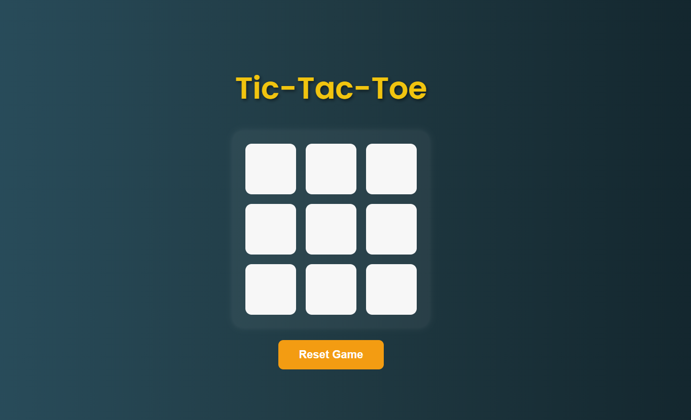

# 🎮 Tic-Tac-Toe Game

A simple and interactive Tic-Tac-Toe game built using **HTML**, **CSS**, and **JavaScript**. This project demonstrates DOM manipulation, game logic, and responsive design in a fun and engaging way.

---

## 🚀 Features

- Two-player game (X and O)
- Turn-based system
- Win/draw detection
- Game reset option
- Responsive and clean UI

---

## 🛠️ Tech Stack

- HTML5
- CSS3
- JavaScript (Vanilla JS)

---

## 📷 Screenshots

 <!-- Replace with your actual screenshot file if available -->

---

## 📁 Folder Structure

Tic-Tac-Toe/
│
├── index.html # Main HTML file
├── style.css # Styling for the game
└── script.js # Game logic